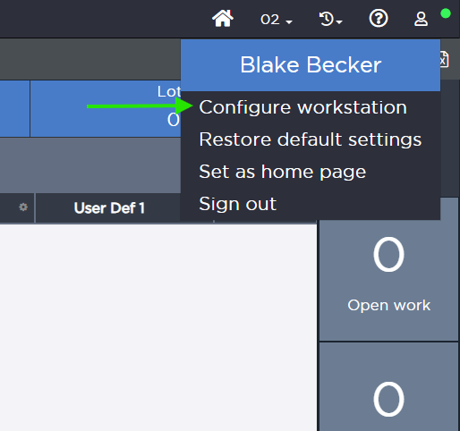
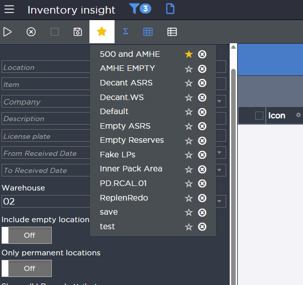

# 🛠️ ScalePlus - Enhanced Scale Application Experience

ScalePlus is a comprehensive userscript that enhances the Scale application with powerful features and improved workflow. All functionality is consolidated into a single script with an intuitive settings interface.

---

## Quick Start Guide

1. **Install** ScalePlus using the steps below
2. **Enable** desired features in the settings by clicking the person icon in top right then **Configure workstation**

3. **Set Default Filters** by clicking stars next to your favorite saved searches
4. **Enjoy** enhanced productivity with keyboard shortcuts and automation!

---

## Dark Mode

Dark mode transforms the results grid into a modern, eye-friendly dark theme that reduces eye strain during extended use.

### Features
- **Results Grid**: Complete dark theme for the main data grid with carefully chosen colors
- **Loading Spinner**: Custom animated blue spinner that replaces the default loading indicator
- **Links**: Blue accent colors for links that maintain readability
- **Icons**: Remain unchanges, but still look good in dark mode

---

## Default State Management

The **Default Filter** feature provides intelligent automation:

### Setting a Default Filter
1. Open any Scale form with saved searches
2. Click the star icon (☆) next to your preferred saved search
3. The star becomes filled (★) indicating it's now the default

### Auto-Application Behavior
- **Page Load**: When you visit a form URL directly (e.g., `/scale/insights/2723`), your default filter automatically applies
- **Clear Filters**: After clicking "Clear Filters", your default filter re-applies automatically
- **Manual Override**: You can still manually select different filters anytime

### Managing Default States
- **Change Default**: Click any empty star (☆) to set a new default
- **Remove Default**: Click the filled star (★) to clear the default state
- **Per-Form Storage**: Each form remembers its own default filter independently

### Middle-Click Favorites
- **Quick Access**: Middle-click any favorite filter to open it in a new tab
- **Automatic Application**: The selected favorite automatically applies when the new tab loads

---

## Right-Click Copy

The **Right-Click Copy** feature provides quick access to copy functionality for grid items:

### Copy Grid Content
- **Right-click** on any grid cell to open a context menu
- **Copy** option extracts and copies the cell's text content
- **Smart Text Extraction**: Automatically handles links and nested content
- **Visual Feedback**: Shows a tooltip confirming what was copied

### Enhanced Workflow
- **Keyboard Alternative**: Middle-click also copies grid content
- **Clipboard Integration**: Seamlessly integrates with system clipboard
- **No Page Disruption**: Copy operations don't interfere with normal page behavior

---

## Right-Click Favorites Menu

The **Right-Click Favorites Menu** provides advanced options for managing saved searches:

### Favorites Management
- **Right-click** on any favorite filter to access additional options
- **Open in New Tab**: Quickly open favorites in new tabs
- **Set as Default**: Mark favorites as default filters with star icons
- **Delete**: Remove unwanted saved searches directly from the menu

### Context Menu Options
- **Smart Positioning**: Menu appears at cursor location
- **Visual Indicators**: Clear icons for each action type
- **State Awareness**: Shows current default filter status
- **Immediate Updates**: Changes reflect instantly in the interface

---

## Tooltips Enhancement

The **Tooltips Enhancement** feature provides helpful tooltips throughout the Scale interface:

### Enhanced Navigation
- **Menu Buttons**: Tooltips for all main menu actions (Apply, Stop, Clear Filters, etc.)
- **Navigation Elements**: Helpful hints for navigation bar items
- **Context-Aware**: Tooltips appear only when relevant

### User Experience
- **Non-Intrusive**: Tooltips appear on hover without disrupting workflow
- **Informative**: Clear descriptions of button functions
- **Consistent**: Standardized tooltip text across the application

---

#### Environment Labels

- **Toggle**: `Environment Labels`
- **Description**: Visual indicators showing current environment
- **Features**:
  - Color-coded banner at top of interface
  - **Production**: Red banner with "PRODUCTION ENVIRONMENT"
  - **QA**: Yellow banner with "QA ENVIRONMENT"
  - Customizable environment names in settings
- **Configuration**:
  - Set custom names for QA and Production environments
  - Names persist across browser sessions

---

## Advanced Criteria Enhance

The **Advanced Criteria Enhance** feature provides enhances the advanced criteria accordian:

### Enhanced Search Interface
- **Improved Layout**: Added the condition column
- **Visual Enhancements**: Shows the number of advanced criteria currently applied

---

## 🔧 Installation

### Prerequisites
- **Tampermonkey** browser extension (available for Chrome, Firefox, Safari, Edge)
- Access to Scale application environments

### Install Steps
1. **Install Tampermonkey Extension**
   - Click here: [Chrome Web Store](https://chrome.google.com/webstore/detail/tampermonkey/dhdgffkkebhmkfjojejmpbldmpobfkfo)
   - Or search for "Tampermonkey" in your browser's extension store

2. **Enable Developer Mode (Important!)**
   - Click the **Extensions** icon in your browser toolbar
   - Find **Tampermonkey** and click **Details**
   - In the top-right corner, enable **Developer Mode**
   - Make sure **User Scripts** are turned on (toggle switch)

3. **Restart Browser**
   - Close and reopen your browser to ensure all settings are applied

4. **Install ScalePlus Script**
   - Click here: [ScalePlus-Modular.user.js](https://github.com/ShutterSeeker/scaleplus-userscripts/raw/refs/heads/main/ScalePlus-Modular.user.js)
   - Tampermonkey will automatically prompt you to install
   - Click **Install**

---

## 🔧 Troubleshooting

### Settings Not Appearing
- Ensure you're on a Scale application page
- Click "Configure workstation" button in the navigation
- Refresh the page if needed

### Features Not Working
- Check that the corresponding toggle is enabled in settings
- Some features require saved searches to be present
- Try refreshing the page

### Default Filters Not Applying
- Verify the Default Filter toggle is enabled
- Ensure you have saved searches available
- Check browser console for any error messages

---

## Technical Details

- **Compatibility**: Works with both QA and Production Scale environments
- **Storage**: Uses localStorage for settings and default filter preferences
- **Performance**: Lightweight with minimal impact on page load times
- **Security**: No data transmission - all processing happens locally

---

## Contributing

Found a bug or have a feature request? Open an issue or submit a pull request!

---

*ScalePlus - Making Scale work better for you*
